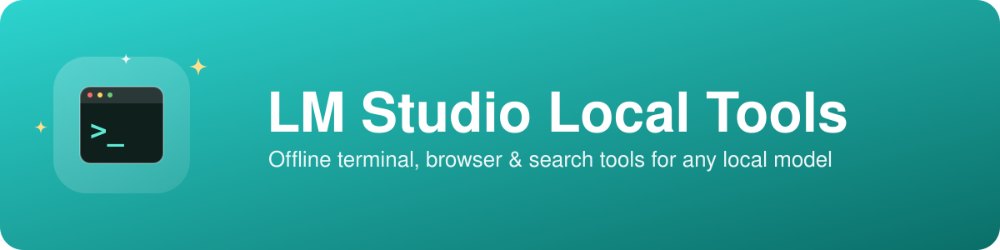
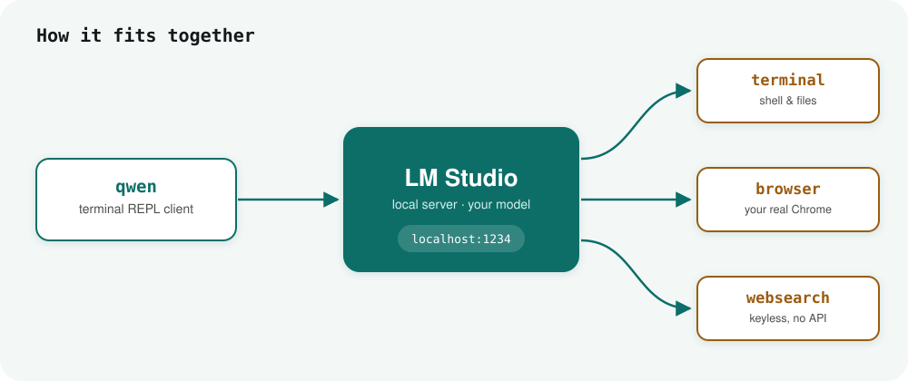

# lmstudio-local-tools

[](https://github.com/RouterGlock/lmstudio-local-tools)
[](LICENSE)

A local-AI fallback stack for [LM Studio](https://lmstudio.ai): terminal and
browser control via MCP, a stdlib-only terminal chat client, and a keyless web
search server. Point any tool-calling-capable local model at your shell, your
real Chrome, and the open web — no cloud API, no API keys, nothing leaves
your machine.



## What's included

| | |
|---|---|
| **`qwen`** | stdlib-only Python REPL that talks to LM Studio's local server API, including MCP tool calls. Works with any tool-calling-capable model. |
| **`rg_websearch_mcp.py`** | keyless MCP server exposing `web_search(query, max_results=5)`, backed by Bing's HTML results page — no API key required. |
| **`mcp.json.example`** | template MCP server config for `~/.lmstudio/mcp.json`. |
| **`scripts/` + `launchagents/`** | optional LaunchAgent to keep the LM Studio local server running in the background. |

MCP servers used:
- **terminal** → [`@wonderwhy-er/desktop-commander`](https://www.npmjs.com/package/@wonderwhy-er/desktop-commander) — shell command execution, file read/write/edit/search.
- **browser** → [`@playwright/mcp`](https://www.npmjs.com/package/@playwright/mcp) `--extension` — controls your real running Chrome via a bridge extension.

Both run via `npx`, no persistent install required.

## Setup

1. **Copy the MCP config.** Copy `mcp.json.example` to `~/.lmstudio/mcp.json`
   (merge with any existing entries), filling in the placeholders:
   - `PLAYWRIGHT_MCP_EXTENSION_TOKEN` — shown when you install the
     [Playwright Extension](https://chromewebstore.google.com/detail/playwright-extension/mmlmfjhmonkocbjadbfplnigmagldckm)
     in Chrome.
   - The absolute path to `rg_websearch_mcp.py` for the `websearch` entry.

2. **Reload MCP servers in LM Studio.** Open LM Studio → left sidebar →
   **Program** (plug/MCP icon). You should see `terminal`, `browser`, and
   `websearch` listed; hit refresh or restart LM Studio if not.

3. **Load a tool-calling capable model** from LM Studio's model picker, and
   enable the `terminal`/`browser`/`websearch` MCP tools for the chat.

4. **Enable server authentication** (Developer tab → Local Server → Server
   Settings): turn on **Require Authentication**, then **Manage Tokens** →
   **Create Token**, and export it:
   ```
   export LM_API_TOKEN="<your token>"
   ```
   This must be on before **"Allow calling servers from mcp.json"** will take
   effect — enabling only the mcp.json toggle without authentication first
   silently does nothing.

## Usage

```
cd lmstudio-local-tools
export LM_API_TOKEN="<your token>"
./qwen                          # interactive REPL, both tools on
./qwen --no-browser              # terminal tool only
./qwen --no-terminal              # browser tool only
./qwen --model "<model-id>"
./qwen --show-reasoning           # show the model's reasoning blocks
./qwen -p "list files in ~/Desktop"   # one-shot, non-interactive
```

```
$ ./qwen
model: qwen/qwen3.8-27b
tools: ['mcp/terminal', 'mcp/browser']
type 'exit' or Ctrl-D to quit

> list the files on my Desktop
[tool] terminal.list_directory({"path": "~/Desktop"})
  -> Portfolio, Screenshots, notes.txt, ...
Your Desktop has a Portfolio folder, a Screenshots folder, and a notes.txt file.
```

The client keeps the conversation stateful across turns, prints each tool
call it makes with a truncated output preview, then the model's final reply.
Type `exit` or Ctrl-D to quit.

**Want to just type `qwen` from anywhere?**
```
ln -s "$(pwd)/qwen" ~/.local/bin/qwen   # make sure ~/.local/bin is on your PATH
```
Then `qwen` works as a plain command in any terminal, no `cd` or `python3` needed.

Test the web search server standalone:
```
python3 rg_websearch_mcp.py --self-test "your query here"
```

### Isolated browser profile (optional)

If you'd rather not install the Playwright extension, edit the `browser`
entry in `mcp.json` to use a separate persistent Chrome profile instead of
your real one:
```json
"args": ["-y", "@playwright/mcp@latest", "--browser", "chrome", "--user-data-dir", "~/.lmstudio-browser-profile"]
```

### Auto-start the LM Studio server

Copy `scripts/ensure-lmstudio-server.sh` to `~/.local/bin/` and
`launchagents/com.lmstudio.server-autostart.plist` to
`~/Library/LaunchAgents/`, updating the paths inside each to match your
username, then:
```
launchctl load ~/Library/LaunchAgents/com.lmstudio.server-autostart.plist
```
This runs `lms server start` at login and every 5 minutes thereafter.

## Safety notes

- **terminal** gives the model real shell access — full read/write/delete on
  your filesystem and the ability to run any command. Leave LM Studio's
  per-tool-call confirmation dialog on (`neverAskForToolConfirmation: false`
  in `~/.lmstudio/settings.json`), and don't approve a command you don't
  understand.
- **browser** with `--extension` can act in your real, logged-in browser.
  Don't approve actions on sensitive tabs you haven't reviewed.
- `qwen` has no per-tool-call confirmation of its own — the API
  executes tool calls immediately once the server setting above is on.
- Local models are more likely than a frontier hosted model to misread
  instructions or run a destructive command by mistake. Review before
  approving anything destructive.

## Notes on the web search backend

`rg_websearch_mcp.py` scrapes Bing's plain HTML results page rather than
DuckDuckGo, because DuckDuckGo's `html.duckduckgo.com` / `lite.duckduckgo.com`
endpoints return an anti-bot CAPTCHA for a bare scripted request. Scraping a
search engine's HTML is inherently a "verify it still works" integration — if
Bing starts blocking requests too, check the page's current markup in a
browser and adjust the regexes accordingly.

## License

MIT © 2026 RouterGlock — see [LICENSE](LICENSE).
